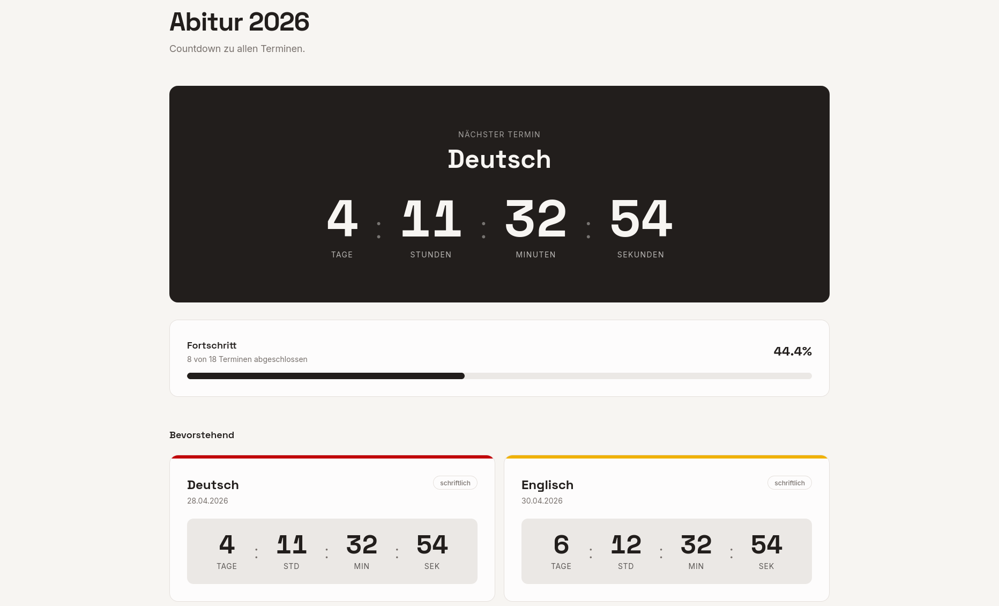

# ABI Countdown

A small **Rust + Dioxus** web app that shows a countdown and status overview for Abitur-related dates.  
It reads event data from `assets/events.json` and separates upcoming and completed milestones automatically.

## Tech Stack

- **Rust**
- **Dioxus** for the frontend UI
- **Tailwind CSS** for styling
- **Chrono** for date/time handling



## Event Data

The app reads its timeline from `assets/events.json`.

Each event includes:

- `name` — event title
- `flag` — optional category label
- `time` — ISO 8601 timestamp
- `color` — Tailwind color class for styling

You can add, remove, or update events without changing the Rust code.

### Example event

```json
{
  "name": "Mathematik",
  "flag": "schriftlich",
  "time": "2026-05-06T07:00:00.000Z",
  "color": "bg-blue-700"
}
```